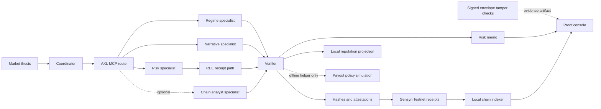

# Signal Count

Proof console for AXL-routed market thesis review in the ETHGlobal OpenAgents /
Gensyn track.

Status: research reference. The project is preserved as a proof-console artifact for Entropy Core and trader intelligence design. Roadmap: `docs/PROJECT_PLAN.md`.

Public evidence status: the repository now tracks a credential-free,
deterministic fixture bundle for routing selection, EIP-191 specialist
signatures, signed verifier attestations, and local REE receipt consistency.
Start with [`docs/evidence/README.md`](docs/evidence/README.md). This is an
evidence-tag candidate, not a live-network or production release.

Do not trust the memo. Verify every specialist behind it.

Signal Count turns one market thesis into an auditable risk memo with visible
proof layers:

- AXL peer routing: which specialist handled which role, through which peer.
- Signed-execution tamper checks: whether a response envelope was changed after
  signing.
- REE receipt path: whether the risk inference path has reproducible evidence.
- Deterministic chain analyst: an optional specialist backed by pinned chain
  events instead of an LLM sample.
- Offline reputation/payout simulation: how a deterministic policy would map
  verifier scores to capped testnet amounts; this is not a runtime transfer.
- Gensyn Testnet receipts: whether task and contribution events were anchored
  outside the app when chain writing was configured.

Signal Count is not a trading bot. A user submits one market thesis, an asset,
and a time horizon. A coordinator dispatches structured analysis requests to
specialist services through AXL, collects their responses, and produces an
auditable risk memo with scenarios, catalysts, risks, invalidation triggers,
and provenance.

Each completed run exposes its AXL peer, output hash, verifier attestation, REE
evidence when enabled, and Gensyn Testnet receipts when configured. Wallet
credit is shown only for a cryptographically verified signed execution.

The product claim is simple: a polished memo is not enough. The useful artifact
is the proof trail behind the memo.

## What It Does

- Accepts a single market thesis through a FastAPI API or proof-console UI.
- Routes work to specialist roles for regime, narrative, and risk analysis.
- Can run a deterministic `chain_analyst` specialist from pinned chain events.
- Records node participation, peer IDs, latency, and topology snapshots.
- Scores specialist outputs through a verifier and records deterministic
  attestation hashes.
- Detects tampered signed execution envelopes for proof-console evidence.
- Can generate deterministic offline reputation/payout simulation ledgers;
  these artifacts do not execute a transfer.
- Can attach a real Gensyn REE receipt to the risk specialist path.
- Can record task and contribution receipt metadata on Gensyn Testnet when
  chain writing is configured.
- Produces a structured memo instead of a generic chat response.
- Renders an operator proof console with AXL peer, wallet, output hash, REE
  status, explorer links, indexed chain facts, and a source-linked memo.
- Degrades explicitly when a specialist is unavailable.

## Why AXL

The coordinator is designed to talk to its local AXL HTTP bridge and address
specialist services by peer ID and service name:

```text
/mcp/{peer_id}/{service_name}
```

That keeps the swarm boundary visible in the product: the demo can show which
peers participated in a run, rather than hiding all analysis inside one local
process.

Without AXL, the coordinator would only have local function calls or opaque API
calls. With AXL, each specialist is an addressable peer with a dispatch target,
topology evidence, selection reason, fallback trail, and contribution receipt.
AXL turns hidden specialist calls into inspectable peer-to-peer work.

## Why REE

REE is not used to claim that a memo is correct. It is used to make the riskiest
model-dependent path inspectable.

Under the active `risk-only-ree` policy, the risk specialist path can expose:

- model name
- prompt hash
- token hash
- receipt hash
- specialist output hash
- contribution transaction

That gives users a receipt trail for the counter-thesis and invalidation path,
where unverifiable reasoning would be the most damaging.

## Architecture

```text
User / Demo UI
  |
FastAPI API
  |
Coordinator
  |
Local AXL bridge
  |
AXL specialist peers
  |-- Regime analyst
  |-- Narrative analyst
  |-- Risk analyst
  |-- Chain analyst (optional)
  |
Signed envelope checks (optional)
  |
Verifier
  |
Local reputation projection
  |
Memo synthesis + provenance ledger
```



## Screenshots

### Main Proof Console


### Specialist Registry And Reputation


### Chain Receipts And Metadata


## Repository Layout

```text
app/
  api/              FastAPI routes
  axl/              AXL registry and client layer
  chain/            Gensyn Testnet transaction and receipt/reputation helpers
  coordinator/      Dispatch and memo synthesis workflow
  evaluation/       Verifier scoring, attestation, reputation, and payout helpers
  integrations/     Model, market data, and news adapters
  nodes/            Specialist service implementations, including chain_analyst
  tamper/           Signed execution tamper evidence helpers
  ree/              Gensyn REE runner and receipt validation
  observability/    Metrics, tracing, provenance records
  orchestration/    Declared workflow graph and per-node graph state
  rendering/        Memo rendering
  schemas/          Pydantic contracts
  store/            SQLite-backed job store
  templates/        Proof-console UI
docs/
  ARCHITECTURE.md   Public architecture notes
  spec.md           Product specification
tests/              Unit and integration tests
```

## Setup

```bash
python -m venv .venv
source .venv/bin/activate
python -m pip install --require-hashes --only-binary=:all: -r requirements-lock.txt
python -m pip install --no-deps --no-build-isolation -e .
```

`requirements-dev.txt` is the human-maintained lock input. The generated
`requirements-lock.txt` is the installation source: every Python distribution
is version- and SHA-256-pinned, including pip and the build toolchain.

## Five-minute Public Evidence Path

From a clean checkout:

```bash
python3 -m venv .venv
source .venv/bin/activate
python -m pip install --require-hashes --only-binary=:all: -r requirements-lock.txt
python -m pip install --no-deps --no-build-isolation -e .
python -m pip check
python scripts/build_public_evidence.py --verify evidence/public-fixture-v1
```

Expected evidence content address:

```text
sha256:0b1691ae31b574072e1bac0d52a375e1cae6329bccb82f1143bc18571fa3ef2e
```

The command regenerates the artifact in memory and compares the exact bundle
file set, every tracked byte, and source checksums. It directly composes the
repository's capability-selection, signing, receipt-check, and
verifier-attestation modules; it is not a replay of the normal coordinator
transport. It performs no AXL dispatch, model inference, RPC lookup, or testnet
write and requires no credentials. All task data, responses, identities, and
signing keys are public synthetic fixtures.

## Run

```bash
uvicorn app.main:app --reload
```

Open:

```text
http://127.0.0.1:8000
```

## Offline Demo Preview

Use this mode when capturing stable screenshots without a live AXL bridge:

```bash
scripts/run_offline_demo.sh
```

The UI labels the topology as `offline-demo-preview` so it is not confused with
a live AXL run.

To preview partial-failure behavior without a live AXL mesh:

```bash
scripts/run_offline_partial_demo.sh
```

By default this forces the `risk` specialist to time out and verifies that the
memo is marked as partial instead of fabricating a missing node response.

## Live AXL Mode

Live mode expects the Gensyn AXL node and MCP router to be running. The
specialist server registers itself with the local MCP router using
`POST /register` and exposes `POST /mcp` for routed specialist requests.

Start the AXL MCP router first:

```bash
python -m mcp_routing.mcp_router --port 9003
```

Then run the three core specialist services in separate terminals:

```bash
scripts/run_node_regime.sh
```

```bash
scripts/run_node_narrative.sh
```

```bash
scripts/run_node_risk.sh
```

The optional deterministic chain analyst role can be served by the same node
server with `NODE_ROLE=chain_analyst` and `NODE_SERVICE_NAME=chain_analyst`.

Finally run the coordinator app with its local AXL bridge URL:

```bash
scripts/run_app_live.sh
```

Useful checks:

```bash
scripts/check_axl.sh
```

Optional multi-candidate routing:

```bash
export RISK_PEER_CANDIDATES="peer-risk-a:risk_analyst,peer-risk-b:risk_analyst"
export REGIME_PEER_CANDIDATES="peer-regime-a:regime_analyst,peer-regime-b:regime_analyst"
export NARRATIVE_PEER_CANDIDATES="peer-narrative-a:narrative_analyst,peer-narrative-b:narrative_analyst"
```

When candidate env vars are set, the coordinator ranks candidates by AXL
topology health and verifier/reputation metadata when available. If the selected
peer fails, it retries the next candidate and records the fallback chain in
`Run Evidence`.

### Historical Local AXL Operator Note

Earlier operator notes report a local Gensyn AXL node, MCP router, and three
specialist services submitting a coordinator job through:

```text
/mcp/{axl_public_key}/{service_name}
```

and recording all three roles as completed with `transport=axl-mcp`:

```text
regime -> regime_analyst
narrative -> narrative_analyst
risk -> risk_analyst
```

No raw artifact for that run is tracked in the clean repository, and the public
fixture does not replay it. Treat this section as `present_only` historical
operator context, not current AXL, remote-mesh, user, or production evidence.

### Multi-Peer AXL Mesh Demo

Signal Count can run with two local AXL nodes that have distinct public keys:

```text
Coordinator app -> AXL node A -> AXL node B -> MCP router B -> specialist services
```

Prepare the mesh configs:

```bash
scripts/prepare_axl_mesh_demo.sh
```

Start the mesh in separate terminals:

```bash
scripts/run_axl_mesh_router.sh
scripts/run_axl_mesh_node_a.sh
scripts/run_axl_mesh_node_b.sh
```

Read the remote peer ID from Node B:

```bash
curl -fsS http://127.0.0.1:9024/topology
```

Then export `AXL_REMOTE_PEER_ID` and start the services:

```bash
export AXL_REMOTE_PEER_ID="<node-b-our_public_key>"
scripts/run_axl_mesh_specialist.sh regime
scripts/run_axl_mesh_specialist.sh narrative
scripts/run_axl_mesh_specialist.sh risk
scripts/run_app_mesh_live.sh
```

Check the mesh:

```bash
scripts/check_axl_mesh.sh
```

In this mode the coordinator uses Node A as its local bridge
(`AXL_LOCAL_BASE_URL=http://127.0.0.1:9022`) while the run evidence points each
specialist dispatch at Node B's public key. This demonstrates separate AXL peer
identities without claiming a remote multi-machine deployment.

### Full Battle Demo Script

For the live transport path, use the full battle runner:

```bash
scripts/run_full_battle_demo.sh
```

It starts the local two-node AXL mesh, MCP router, three specialist services,
the coordinator app, REE-backed risk execution, Gensyn Testnet receipt writes,
one-shot chain indexing, and the web viewer. The current AXL specialist
transport returns unsigned `SpecialistResponse` objects. Consequently, normal
runs are not credit-eligible and cannot produce a reputation transaction or
native test-ETH payout; the script explicitly disables both paths and fails if
either appears. Terminal output is formatted into clear demo sections while
`.runtime/full-battle/summary.txt` remains plain text for evidence sharing.

Default viewer URL:

```text
http://127.0.0.1:8004
```

Stop the demo processes with:

```bash
scripts/stop_full_battle_demo.sh
```

Historical operator notes from a May 2, 2026 full-battle recording mentioned a
job, runtime counts, REE output, and reputation/payout receipts. The ignored raw
runtime directory is absent from a clean checkout, so none of those details is
reproducible evidence here. In particular, they do not establish that the
current unsigned coordinator path executed a reputation transaction or payout.

Treat those older notes as `present_only`; the tracked public fixture does not
reproduce or upgrade them into release evidence. Do not cite them as current
network, user, production, economic, or security proof.

## Proof Console UI

The browser UI is built around verification first:

- Capability strip shows live mode, AXL transport, REE presence, chain receipt
  status, and indexed contribution count.
- The thesis form stays at the top of the page, and the latest completed run
  opens directly below it on the verification/proof ledger surface.
- Replayable fixtures remain available below the completed proof surface.
- Demo fixtures remain replayable for stable walkthroughs.
- Latest run is split into `Run Timeline`, `Risk Memo`, and `Proof Ledger`.
- Proof ledger exposes specialist registry, task trace, full hashes, REE status,
  explorer links, reputation evidence, indexed events, run metadata, and
  topology.
- Long peer IDs, hashes, and tx links wrap safely for laptop and mobile widths.

## Proof Layer

Signal Count's proof path is intentionally explicit:

```text
AXL dispatch evidence
  -> optional signed-envelope tamper evidence
  -> specialist output hash
  -> optional deterministic chain analyst snapshot
  -> verifier attestation and score
  -> zero wallet credit for an unsigned normal-runtime response
  -> optional REE receipt hash/status
  -> optional Gensyn Testnet task/contribution receipt tx
  -> indexed chain-event projection
```

Offline only: verifier-score scenarios can be passed through the payout policy
simulation. That helper does not execute or prove a transaction.

What the tracked public fixture verifies locally:

- The capability registry selects three fixture peers from a fixed topology and
  records the intended `/mcp/{peer}/{service}` targets without dispatching.
- Three specialist response envelopes canonical-hash, recover their fixture
  EIP-191 signers, and bind task, role, peer, wallet, and output.
- Three verifier attestations canonical-hash, carry EIP-191 signatures, and
  recover the fixture verifier wallet.
- The synthetic risk receipt binds prompt, canonical parameters, and text output
  to supported component hashes and recomputes the master commitment;
  `validated` means only those local consistency checks.
- Each historical contract/address/deployment-transaction/explorer tuple must
  match one exact structured row in `docs/gensyn-contracts.md`; the fixture does
  not query RPC or confirm it.

The broader live AXL, REE, testnet-write, and indexer paths remain in the
codebase and tests, but they are outside this credential-free evidence claim.
Reputation transaction and payout helpers also remain covered as isolated
components; they are unavailable from the normal unsigned coordinator path.

What is not claimed:

- No remote multi-machine AXL deployment unless the mesh scripts are run on
  separate hosts.
- No ERC20, USDC, stablecoin, or real-money reward flow.
- No current native test-ETH payout or reputation-transaction evidence is
  claimed; normal runtime responses are unsigned and receive zero wallet credit.
- No full archival chain reorg rollback beyond the configured repair window.
- Market/news inputs in the demo are fixture-labelled, not live market data.
- Signal Count is decision support, not trading advice or price prediction.

## Test

```bash
python -m pytest tests/ -q --tb=short
ruff check app/ tests/
ruff format --check app/ tests/
```

CI installs the locked dependency graph, runs `pip check`, lint/format checks,
the complete test suite, and exact public-bundle reproduction. A green check is
code/evidence verification; it is not evidence of external use or production
operation.

## Submission Notes

- Category: OpenAgents / Gensyn
- Emoji: ⚖️
- Short description: Proof console for AXL-routed analyst work: verify every
  specialist behind the memo.
- One-liner: AXL makes coordination auditable, REE validates the risk path, and
  Gensyn Testnet receipts anchor the contribution trail.

## AI Usage

AI tools were used during development for implementation assistance, test
iteration, and wording support. Product design, architecture choices, scope
control, AXL integration boundaries, and final submission decisions are
human-directed.
